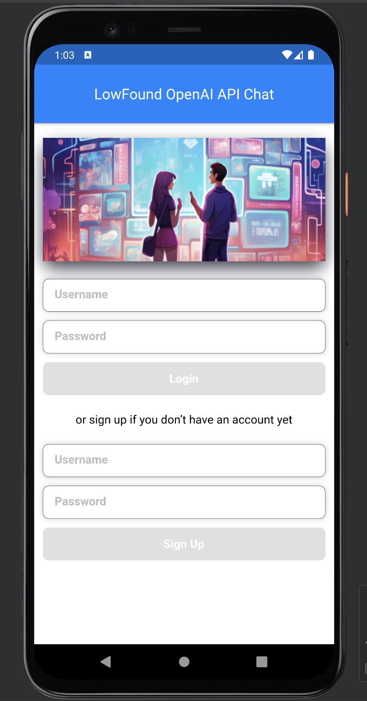
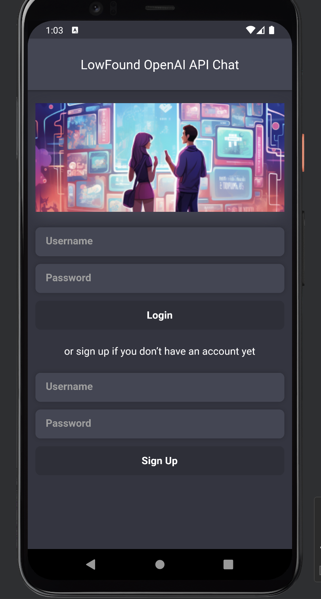
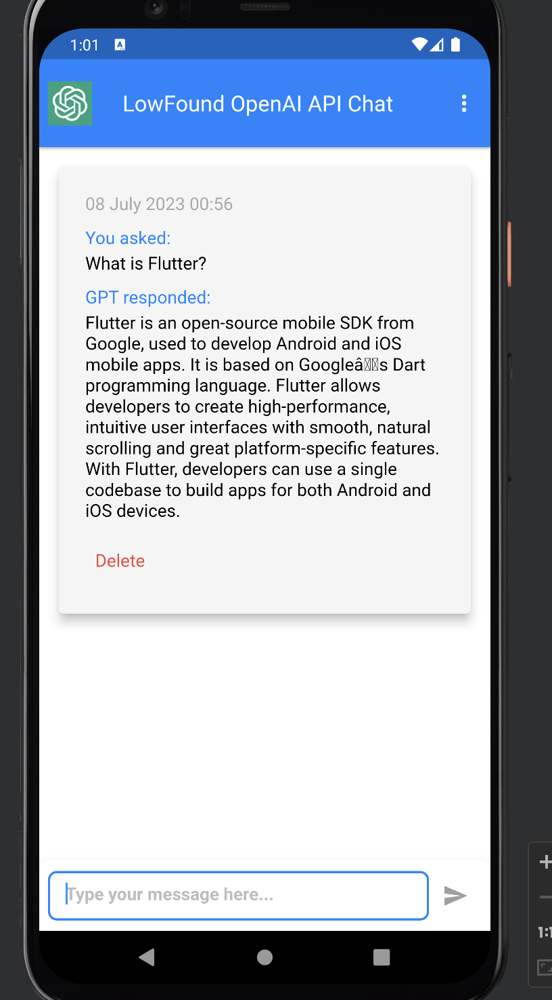
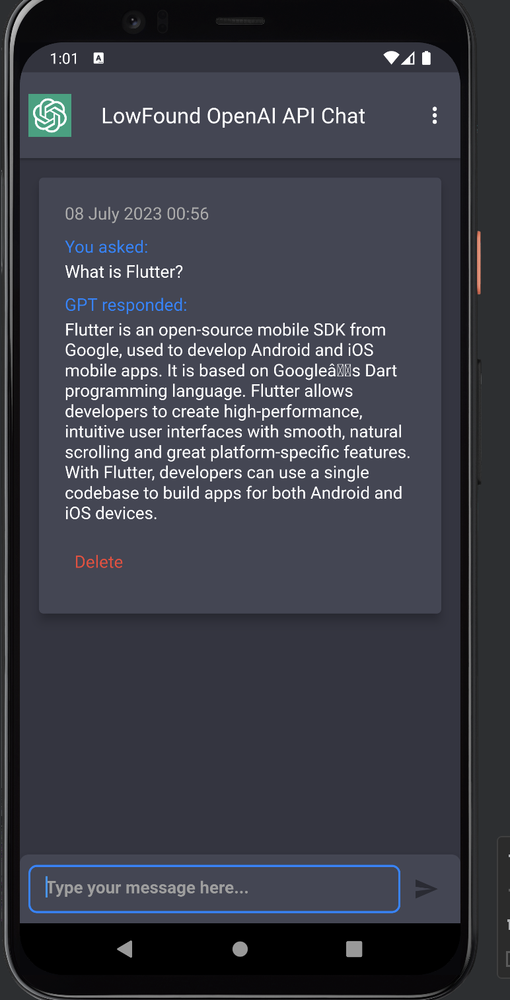

# AI Chatbot with OpenAI Integration 🤖

A fully functional AI Chat application built with Flutter. This app communicates with the OpenAI API to provide intelligent, real-time responses.

## ✨ Key Features
- **OpenAI Integration:** Powered by GPT models for natural conversations.
- **Dynamic UI:** Seamless switching between Dark and Light modes.
- **Real-time Interaction:** Smooth handling of API requests and responses.
- **Clean Architecture:** Organized code for easy API key configuration.

---

## 📸 Screenshots

| 
Light Mode
 | 
Dark Mode
 |
|:---:|:---:|
| 
<b>Login Screen</b>
 | 
<b>Login Screen</b>
 |
|  |  |
| 
<b>Chat Screen</b>
 | 
<b>Chat Screen</b>
 |
|  |  |

---

## 🛠️ Tech Stack
- **Framework:** Flutter
- **State Management:** (Provider)
- **API:** OpenAI (REST API)
